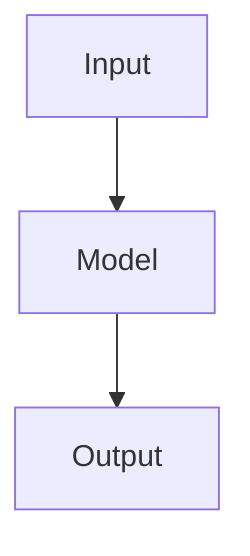
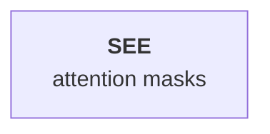

# Writing a post in MDX

A published post is one folder under `src/content/posts/<slug>/`, holding an `index.mdx` plus any images and per-post components. This is the exact MDX each block compiles to — write it here and it renders on the site as-is, and loading the file into `/write` maps every block back into the editor.

```
src/content/posts/your-slug/
├── index.mdx          the post
├── hero.png           images referenced by the post
└── Widget.tsx         per-post components (optional)
```

The folder name is the URL slug (`/blog/your-slug`). Keep it lowercase, hyphenated, stable.

---

## Frontmatter

The file opens with a YAML block:

```yaml
---
title: 'Post title'
summary: 'One or two sentences shown under the title and in search/social cards.'
authors: ['guest'] # one or more handles from src/content/authors/
date: '2026-07-20'
updated: '2026-07-20'
readMin: 8
topic: 'Architecture' # human label (optional, pair with topicId)
topicId: 'architecture' # id from src/content/topics/ (optional)
tags: ['attention', 'kernels'] # optional, max 5
proposedTopic: '' # optional — a topic not in the list yet, for a maintainer to add
cover: './hero.png' # optional — local file or remote URL
ogCard: true # optional — generated share card over the cover (needs cover)
---
```

**Required:** `title`, `summary`, `authors`, `date`. **Recommended:** `readMin`. Everything else is optional. Use single quotes; escape an inner quote by doubling it (`''`). Omit `topic`/`topicId` together if there's no fit; omit `cover`/`ogCard` if there's no cover.

---

## Headings

The post title is the page's `H1`, so body headings start at `##`:

```md
## Section (H2)

### Subsection (H3)

#### Minor heading (H4)
```

Each heading automatically gets a hover copy-link — nothing to add.

---

## Text and inline formatting

Standard Markdown, plus a few inline extras:

```md
**bold**, _italic_, ~~strikethrough~~, `inline code`, [a link](https://example.com),
<u>underline</u>, and inline math $1/\sqrt{d_k}$.
```

- **Emphasis has one canonical spelling.** Use `**bold**` and `_italic_` — not `__bold__` or `*italic*`. All four are valid Markdown and render identically, but the editor stores emphasis as a flag with no memory of which character was typed, and writes `**` and `_` back out. A post using the other spellings comes back rewritten the first time it is opened in `/write`, putting diff noise on lines nobody edited.
- **Inline math:** `$...$` with **no space just inside** the delimiters (`$ x $` stays literal, so `$5 and $10` is safe). Publishes verbatim, rendered by KaTeX.
- **Colored text** (use sparingly; never as the only signal): a span with a named palette color or a hex value —
  ```md
  <span style="color: var(--tc-red, #e03e3e)">warning</span>
  ```
  Named colors: `gray`, `brown`, `red`, `orange`, `yellow`, `green`, `blue`, `purple`, `pink` (background variant: `--mark-<name>`).
- **Center or right-align** a block by wrapping it (keep the blank lines):

  ```md
  <div style="text-align: center">

  Centered paragraph.

  </div>
  ```

---

## Lists

```md
- bullet
- another

1. numbered
2. another

- [ ] unchecked task
- [x] checked task
```

Indent nested items under their parent.

---

## Quote

```md
> A pull-quote or aside.
```

---

## Code block

Fenced with a language tag (Shiki highlighting):

````md
```python
def attention(q, k, v):
    return softmax(q @ k.T / d**0.5) @ v
```
````

Common languages: `text`, `python`, `cpp`, `cuda`, `rust`, `go`, `typescript`, `tsx`, `javascript`, `bash`, `json`, `yaml`, `sql`, `html`, `css`, `diff`, `markdown`, `latex`, and many more.

---

## Math (display)

A centered display equation on its own lines:

```md
$$
\text{Attention}(Q, K, V) = \text{softmax}\left(\frac{QK^T}{\sqrt{d_k}}\right)V
$$
```

Write real LaTeX (single backslashes here — double them only in the JSON format).

---

## Table

A plain Markdown table renders with the default style:

```md
| Model | Params | VRAM (FP16) |
| ----- | ------ | ----------- |
| 7B    | 7e9    | 14 GB       |
| 70B   | 70e9   | 140 GB      |
```

To restyle, wrap it in `<Table>` (**keep the blank lines** around the table — MDX needs them):

```md
<Table variant="lined" zebra caption="Memory by model size">

| Model | Params | VRAM (FP16) |
| ----- | ------ | ----------- |
| 7B    | 7e9    | 14 GB       |

</Table>
```

**Options:**

- `variant` — `"rule"` (default: header underline + hairline rows), `"lined"` (full grid), `"plain"` (header underline only).
- `zebra` — boolean flag; shades alternate rows. Stacks on any `variant`.
- `caption` — optional text centered under the table.

The first row is the header. Markdown formatting works inside cells.

---

## Note (callout)

```md
<Note>A short highlighted aside the reader shouldn't miss.</Note>
```

---

## Section breaks

```md
---
```

A lone `---` (blank line above and below) renders as a centered `· · ·` break. For a plain horizontal rule instead:

```md
<hr className="article-hr article-hr--line" />
```

---

## Collapsible section (click to expand)

````mdx
<details>
<summary>Click to expand</summary>

Prose, lists, tables, math and code all work in here.

```python
def hidden(): ...
```

</details>
````

**The blank lines are required.** MDX only reads the inside of a `<details>` as
Markdown when the content is separated from the tags by blank lines. Without
them you get literal text instead of a code block.

### What can go inside

Nesting is for **code, prose, lists and tables** — a hidden walkthrough, a long
listing, an aside the reader can skip.

| Works nested                     | Does not                |
| -------------------------------- | ----------------------- |
| Paragraphs, `##`–`####` headings | `<Figure>` (images)     |
| Bullet, numbered and check lists | `<Gallery>`             |
| Quotes                           | `<Video>`               |
| Fenced code blocks               | `<Note>`                |
| `$$ math $$`                     | Inline-SVG diagrams     |
| Pipe tables                      | Mermaid diagrams        |
| `---` and `<hr />` breaks        | Custom React components |

The right-hand column publishes fine, but it **cannot be read back**. The
converter parses a `<details>` body as plain Markdown, so anything that
publishes as a JSX tag has no reader on the way in and returns as a paragraph —
the block is destroyed the next time the entry is opened in `/write`. A nested
mermaid diagram degrades to an ordinary code block rather than a diagram.

The same limit applies to blocks indented under a list item. Keep media and
components at the top level, where the converter has a pattern for each.

The editor hides these from the slash menu while the cursor is nested, so this
only bites when writing MDX by hand.

### Doing it in the editor instead

`/toggle` → type the summary → click **▸** to expand → click _"Empty toggle.
Click to add a block."_ → `/code`.

Inside a code block Enter is a newline, so multi-line works as expected. To get
**out** of the block and add another one inside the same toggle, press Enter
three times.

---

## Figure (image)

Local images are imported at the top of the file, then referenced with `<Image>` inside `<Figure>`:

```mdx
import { Image } from 'astro:assets';
import hero from './hero.png';

<Figure caption="What the diagram shows." width={620}>
  <Image src={hero} alt="describe the image" />
</Figure>
```

**Options:**

- `width` — one of exactly `360` (small), `620` (medium), `960` (large). Omit for the default (small, centered).
- `caption` — optional text under the image.
- `alt` — **required** on the image, for accessibility.

For a remote image (or a placeholder to fill in later), use a plain `` instead of `<Image>` — no import needed:

```mdx
<Figure caption="Replace with the real chart.">
  
</Figure>
```

---

## Gallery (image row)

Several images that flow into as many columns as fit:

```mdx
import { Image } from 'astro:assets';
import a from './a.png';
import b from './b.png';

<Gallery min={240}>
  <Image src={a} alt="..." />
  <Image src={b} alt="..." />
</Gallery>
```

`min` (optional) is the smallest a cell may get, in px, before wrapping to a new row. Omit for the default grid.

---

## Video (YouTube)

```mdx
<Video id="dQw4w9WgXcQ" caption="Optional caption." />
```

`id` is the 11-character YouTube id (the `v=` value), not a URL. It loads only when the reader clicks play. `caption` is optional.

---

## Inline SVG diagram

Paste a self-contained `<svg>` inside `<Figure>`; it renders crisp at any size and adapts to dark mode:

```mdx
<Figure caption="A hand-drawn diagram." width={620}>
  <svg viewBox="0 0 470 160" role="img" aria-label="what the diagram shows"
       style="width:100%;height:auto;color:currentColor"
       fill="none" stroke="currentColor" xmlns="http://www.w3.org/2000/svg">
    <!-- shapes using stroke/fill="currentColor" -->
  </svg>
</Figure>
```

Rules: use `stroke="currentColor"`/`fill="currentColor"` so it follows the theme; give the root `style="width:100%;height:auto;color:currentColor"`; include `role="img"` + `aria-label`; keep the SVG self-contained (no external references).

**Size:** control the diagram's size with `width` on the `<Figure>`, the same scale images use — `360` (small), `620` (medium, aligns with the text column — the default), or `960` (large, breaks out wider than the text). It centers and stays responsive at every size. Let the SVG's own width be `100%` (don't hard-cap it with `max-width`) so it fills whichever size you pick.

---

## Mermaid diagram

Write the diagram as a fenced `mermaid` block with its source:

````md

````

**Note:** a mermaid fence does not render to a diagram on its own — on the published page it shows as a code block. (Opening the post in the editor and publishing is what turns it into a picture; an undrawn diagram now falls back to this fence rather than being dropped.) To turn it into a rendered diagram, open the post in the [`/write`](https://mlsystems.dev/write) editor: it loads the fence as an editable Mermaid block, draws it, and bakes the finished SVG into the post on publishing. So writing the fence here is a convenient way to draft and carry a diagram's source (it survives an edit round-trip and can be copied); the editor does the actual rendering.

**Label formatting:** for **bold** or _italic_ inside a node label, use mermaid markdown strings — wrap the label in backticks and use `**bold**` / `*italic*`, with real line breaks for multi-line labels. HTML tags like `<b>` are **not** interpreted (they render as literal text), so don't use them.

````md

````

---

## Custom React component (interactive)

Put the component in the post folder as a default-exporting `.tsx`, e.g. `./Widget.tsx`, then import and drop it in with a hydration directive:

```mdx
import Widget from './Widget';

<Widget client:visible />
```

`client:visible` hydrates it when it scrolls into view (`client:load` for immediately). To give it a titled/captioned frame, wrap it in `<Interactive>`:

```mdx
import Interactive from '../../../components/Interactive';
import Widget from './Widget';

<Interactive title="Attention explorer" caption="Drag to change the mask." size="wide" expand client:load>
  <Widget client:visible />
</Interactive>
```

**`<Interactive>` options:**

- `title` — small label above the frame.
- `caption` — caption below the frame (put explanatory text here, not inside the component).
- `size` — `"wide"` renders up to 960px, past the text column; omit for normal width.
- `expand` — boolean flag; adds a fullscreen expand button.
