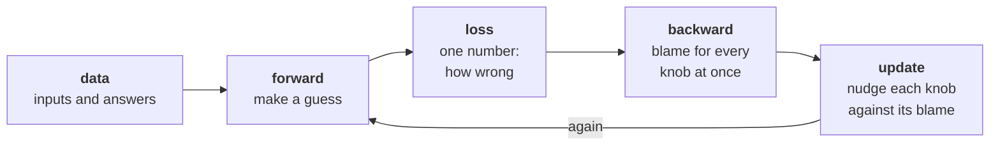

import SeparatorLab from './SeparatorLab';
import Interactive from '../../../components/Interactive';
import NudgeLab from './NudgeLab';
import BackpropGraph from './BackpropGraph';
import XorLab from './XorLab';

_LLM From Scratch · Part 1 of 13 — one tiny GPT, one component per post, from a single neuron to a modern language model._

Nobody taught you the rule for recognising a friend’s handwriting. There isn’t one you could write down. You saw enough of it, and at some point you knew.

Every machine-learning system is trying to copy that trick, and underneath all of them is one question asked millions of times a second: **that was wrong, so what should I change?**

Start with a puzzle.

---

## Four dots

Two filled, two hollow. Draw one straight line with both filled dots on one side and both hollow dots on the other.

<Interactive title="Separate the filled dots from the hollow ones" caption="Rotate the line, slide it, or swap which side counts as filled. A red × marks a dot on the wrong side." size="wide" expand client:load>
  <SeparatorLab client:visible />
</Interactive>

You’ll reach three. You won’t reach four — no such line exists, and shortly we’ll see exactly why.

But notice how you searched. Look, try, see what’s wrong, adjust. Rotate a bit. Too far. Back.

That is the entire post.

---

## How a brain does it

Your head holds about 86 billion neurons. A neuron is a cell with an unusual shape, and the shape is the story.

<Figure caption="Signals arrive on the dendrites, gather in the cell body, and if enough arrive at once the cell fires — one pulse, down the axon, across the synapse, to whatever comes next." width={620}>
<svg viewBox="0 0 640 250" role="img" aria-label="A biological neuron: dendrites fanning into a cell body, a long axon, and terminals meeting the next cell across a synapse"
     style="width:100%;height:auto;color:currentColor"
     fill="none" stroke="currentColor" stroke-linecap="round" xmlns="http://www.w3.org/2000/svg">

  <g stroke-width="2.2">
    <path d="M188 99 C 168 78, 150 52, 127 26" />
    <path d="M177 116 C 150 110, 118 100, 85 91" />
    <path d="M178 137 C 152 146, 120 158, 89 169" />
    <path d="M190 153 C 176 178, 160 198, 142 214" />
  </g>
  <g stroke-width="1.3">
    <path d="M170 76 C 152 72, 136 68, 120 66" />
    <path d="M152 147 C 140 158, 130 168, 122 182" />
  </g>

  <circle cx="210" cy="125" r="34" stroke-width="2.6" />
  <circle cx="210" cy="125" r="11" fill="currentColor" stroke="none" opacity="0.4" />

  <line x1="244" y1="125" x2="450" y2="125" stroke-width="3.2" />

  <g stroke-width="2.2">
    <path d="M450 125 C 478 122, 490 100, 505 88" />
    <path d="M450 125 L 511 125" />
    <path d="M450 125 C 478 128, 490 150, 505 162" />
  </g>
  <g fill="currentColor" stroke="none">
    <circle cx="510" cy="85" r="6.5" />
    <circle cx="516" cy="125" r="6.5" />
    <circle cx="510" cy="165" r="6.5" />
  </g>

  <g stroke-width="2.4" opacity="0.42">
    <path d="M541 40 C 531 74, 533 106, 546 142" />
    <path d="M534 92 C 548 97, 560 102, 578 99" />
  </g>

  <g fill="currentColor" stroke="none" font-size="13" font-family="monospace">
    <text x="70" y="216" text-anchor="middle">dendrites</text>
    <text x="232" y="72" text-anchor="middle">cell body</text>
    <text x="332" y="154" text-anchor="middle">axon</text>
    <text x="498" y="204" text-anchor="middle">axon terminal</text>
    <text x="474" y="40" text-anchor="middle">synapse</text>
    <text x="626" y="150" text-anchor="end" opacity="0.5">next cell</text>
  </g>
  <g stroke-width="1" opacity="0.4" stroke-dasharray="2 2">
    <line x1="76" y1="207" x2="90" y2="180" />
    <line x1="228" y1="78" x2="218" y2="93" />
    <line x1="332" y1="148" x2="332" y2="132" />
    <line x1="500" y1="194" x2="507" y2="176" />
    <line x1="482" y1="46" x2="521" y2="79" />
  </g>
</svg>
</Figure>

Left to right, the way the signal travels.

**Dendrites** are the ears — thousands of connections from other neurons land here.

**The cell body** adds everything up. Not equally: a connection used often has physically thickened, and a thick connection shouts while a thin one whispers. That junction is a **synapse**, and its strength is the memory.

**Then a threshold.** Enough total, and the cell fires — one full-size pulse down the **axon**. Not enough, and nothing happens. Not a dial, a decision.

Hebb, 1949, five words: **cells that fire together wire together.** Use a connection and it thickens; neglect it and it fades.

So the knowledge isn’t in the neurons. It’s in the connection strengths. Learning is those strengths changing.

---

## Copying it

Same picture, made of numbers, same left-to-right flow.

<Figure caption="Each input is multiplied by its own weight, the results are summed with a bias, and the total passes through a function that decides how strongly the unit responds." width={620}>
<svg viewBox="0 0 660 250" role="img" aria-label="An artificial neuron: three inputs multiplied by weights, summed with a bias, passed through an activation function to an output"
     style="width:100%;height:auto;color:currentColor"
     fill="none" stroke="currentColor" xmlns="http://www.w3.org/2000/svg">
  <g stroke-width="1.6">
    <circle cx="62" cy="60" r="19" />
    <circle cx="62" cy="120" r="19" />
    <circle cx="62" cy="180" r="19" />
  </g>
  <g fill="currentColor" stroke="none" font-size="12" font-family="monospace" text-anchor="middle">
    <text x="62" y="65">x1</text>
    <text x="62" y="125">x2</text>
    <text x="62" y="185">x3</text>
  </g>
  <g stroke-width="1.5" opacity="0.8">
    <path d="M82 66 L 268 108" />
    <path d="M82 120 L 266 120" />
    <path d="M82 174 L 268 132" />
  </g>
  <g fill="currentColor" stroke="none" font-size="11.5" font-family="monospace" text-anchor="middle">
    <text x="170" y="79">× w1</text>
    <text x="170" y="113">× w2</text>
    <text x="170" y="167">× w3</text>
  </g>
  <circle cx="300" cy="120" r="32" stroke-width="2" />
  <text x="300" y="127" fill="currentColor" stroke="none" font-size="19" font-family="monospace" text-anchor="middle">Σ</text>
  <g stroke-width="1.5" opacity="0.8">
    <line x1="300" y1="52" x2="300" y2="86" />
    <path d="M296 82 L 300 88 L 304 82" />
  </g>
  <text x="300" y="44" fill="currentColor" stroke="none" font-size="11.5" font-family="monospace" text-anchor="middle">+ b</text>
  <g stroke-width="1.5">
    <line x1="332" y1="120" x2="404" y2="120" />
    <path d="M400 116 L 406 120 L 400 124" />
  </g>
  <rect x="410" y="88" width="66" height="64" rx="7" stroke-width="2" />
  <path d="M420 142 C 436 142, 438 98, 466 98" stroke-width="1.8" opacity="0.85" />
  <g stroke-width="1.5">
    <line x1="476" y1="120" x2="556" y2="120" />
    <path d="M552 116 L 558 120 L 552 124" />
  </g>
  <text x="574" y="126" fill="currentColor" stroke="none" font-size="14" font-family="monospace">a</text>
  <g fill="currentColor" stroke="none" font-size="11" font-family="monospace" opacity="0.75">
    <text x="62" y="222" text-anchor="middle">inputs</text>
    <text x="170" y="222" text-anchor="middle">weights</text>
    <text x="300" y="222" text-anchor="middle">add it up</text>
    <text x="443" y="222" text-anchor="middle">respond</text>
    <text x="574" y="222" text-anchor="middle">output</text>
  </g>
  <g stroke-width="1" opacity="0.35" stroke-dasharray="2 2">
    <line x1="62" y1="200" x2="62" y2="212" />
    <line x1="170" y1="180" x2="170" y2="212" />
    <line x1="300" y1="156" x2="300" y2="212" />
    <line x1="443" y1="156" x2="443" y2="212" />
    <line x1="574" y1="134" x2="574" y2="212" />
  </g>
</svg>
</Figure>

<Table variant="lined" caption="Piece for piece.">

| In the cell | In the arithmetic | What it is |
| --- | --- | --- |
| an incoming signal | $x_1, x_2, x_3$ | a number |
| synapse strength | $w_1, w_2, w_3$ | a number — the only thing learning changes |
| how easily this cell fires | $b$, the bias | its leaning before any input arrives |
| adding up in the cell body | $\Sigma$ | each input times its weight, summed |
| the firing threshold | the activation function | turns the total into a response |

</Table>

The whole cell is one line:

$$
a = f\left(w_1 x_1 + w_2 x_2 + w_3 x_3 + b\right)
$$

In words: **a neuron is a weighted vote.** Each input gets a say, the weight is how loud, the bias is the unit’s own leaning, and $f$ turns the verdict into a response.

One substitution needs explaining. A real neuron fires or doesn’t — a cliff. Soon we’ll ask “change this weight a hair; what happens to the answer?”, and at a cliff there is no answer. So $f$ is a smooth S instead: near 0 for small totals, near 1 for large, bending in between. Same behaviour, no cliff.

<Note>**Where the resemblance ends.** Real neurons communicate in timed spikes, not steady numbers, and _when_ a pulse arrives can matter as much as whether it does. A cortical neuron has around 10,000 synapses, not three. Real synapses change by local chemistry, with no equivalent of the global error signal we’re about to build — the brain is almost certainly not running this algorithm. The borrowing is a metaphor that proved useful, not a model of biology.</Note>

---

## One neuron on the four dots

Give it two inputs, the coordinates of a dot, and ask for one number: high for filled, low for hollow.

It responds to $w_1x_1 + w_2x_2 + b$, so it flips from low to high where that crosses zero — and

$$
w_1 x_1 + w_2 x_2 + b = 0
$$

is a straight line. Always. Choosing the three weights only chooses _which_ line: the angle and position sliders you just used.

So a single neuron is the puzzle you already lost. We’ll settle that. First, the question this post exists for: **where do the weights come from?**

You set two by hand on four points. A language model has hundreds of billions. Nobody sets those.

---

## How anything gets better

Smaller problem. Some quantity is always double another; you have three examples. Your machine has one knob $w$ and guesses $w \times x$. It starts at $w = 0.2$, because it has to start somewhere.

<Table variant="lined" caption="Three examples, one bad guess.">

| x | true answer | machine says | off by |
| --- | --- | --- | --- |
| 1 | 2 | 0\.2 | 1\.8 |
| 2 | 4 | 0\.4 | 3\.6 |
| 3 | 6 | 0\.6 | 5\.4 |

</Table>

Three complaints. You can’t chase three numbers at once, so square each and average:

$$
L = \tfrac{1}{3}\left(1.8^2 + 3.6^2 + 5.4^2\right) = 15.12
$$

That’s the **loss** — the score to make small. Squaring stops a miss of $-3$ cancelling a miss of $+3$, and makes the score a smooth bowl rather than a creased V, which matters in a moment.

The data is fixed. Only the knob moves. So the job is to find the bottom of a curve.

### Turn it and see

Want to know which way to turn? Turn it up a little and look at the score. Better — keep going. Worse — go the other way.

That’s the method. For _how urgently_, divide: score changed by this much, over a nudge of that much. Big ratio, the knob matters a lot here. Small ratio, you’re near the bottom.

That ratio is the **gradient**. Nothing more than what you just measured.

<Note>**Guess first.** At $w = 0.2$, does nudging $w$ up make the score better or worse? And as the nudge shrinks from 0.5 to 0.01, does the measured answer move toward the exact one, away, or stay put? Deciding before you look is worth more than reading it off the screen.</Note>

<Interactive title="Turn the knob, watch the score" caption="The curve is the score at every possible setting; the filled dot is where you are. The dashed line is what one nudge measures — score here, score after, divided by the nudge. The solid line is the exact answer. Shrink ε and the dashed line swings onto the solid one." size="wide" expand client:load>
  <NudgeLab client:visible />
</Interactive>

Four things there, all still true at a hundred billion knobs.

**The sign says which way, and you go against it.** Positive slope means turning up makes it worse, so turn down. That’s the minus sign in the one rule that runs all of this:

$$
w \leftarrow w - \eta \cdot \frac{\partial L}{\partial w}
$$

New setting = old setting, minus a fraction of the slope. $\partial L/\partial w$ is the ratio you measured; $\eta$, the **learning rate**, is what fraction of the advice you take. Repeat it and you have **gradient descent**.

**The size says how far.** Steep curve, long steps. Near the bottom it flattens and the steps shrink by themselves — nobody arranges that, it’s the shape of the bowl.

**Too big a step ruins it.** Raise the learning rate and the score climbs: each step sails past the bottom and lands higher up the far wall. This is the most common way a training run dies.

**And the measurement is approximate.** The blue line is a shortcut between two points on a curve, so it’s a little off — wider nudge, more off. Shrink ε and it swings onto the exact answer. That limit is what calculus gives you instantly. Calculus isn’t a different idea here; it’s this idea with the error removed.

---

## Why we can’t just keep nudging

Nothing stops us nudging a second knob, and a third. Count the cost.

Learning about one knob means running the whole machine again with that knob nudged. The nudge says nothing about any other knob, so you do it again. And again.

<Table variant="lined" zebra caption="Runs of the model needed to learn which way to turn every knob, once. The last row is a single training step; a real run needs hundreds of thousands.">

| Model | Knobs | Runs needed |
| --- | --- | --- |
| Our one-knob toy | 1 | 2 |
| The network at the end of this post | 17 | 34 |
| A small image classifier | \~100,000 | 200,000 |
| GPT-2 small | 124,000,000 | **248,000,000** |

</Table>

248 million runs for **one** step. Hardware doesn’t save you: the cost grows with the number of knobs, and the number of knobs is exactly what has grown.

Right about what we need, hopeless at getting it. Something has to produce all of those numbers at once.

---

## Blame, flowing backwards

A factory line. Four stations, one dial each. A part goes down the line and the inspector at the end says: **six millimetres too long.**

Every station wants the same thing: how much of that is mine, and which way do I turn?

Station 4, next to the inspector, knows immediately — it knows what its dial does to the part it hands over. Station 3 can’t answer directly, but it can ask station 4 one question: _if what I hand you shifts by one unit, how much does the final error shift?_ Station 4 already worked that out. Multiply by what station 3’s own dial does to its own output, and station 3 knows too. Then station 2 asks station 3.

One pass down, one pass back, and every station has its answer. Not one pass each — one pass, total.

That’s backpropagation:

$$
\underbrace{\frac{\partial L}{\partial (\text{my input})}}_{\text{what I pass back}} = \underbrace{\frac{\partial (\text{my output})}{\partial (\text{my input})}}_{\text{I know this alone}} \times \underbrace{\frac{\partial L}{\partial (\text{my output})}}_{\text{what was handed to me}}
$$

**Local effect times incoming blame.** No station understands the factory. Each knows its own operation and one number. That’s why it works at any size.

<Note>**Where the analogy breaks.** A factory line is one chain; real networks branch, and a value often feeds several places. Then the blame from each branch **adds up**, because disturbing that value moves the result along every path it takes. This is the detail a hand-written version usually gets silently wrong.</Note>

### Five steps by hand

A real neuron, taken apart:

$$
p = w \cdot x \quad\rightarrow\quad n = p + b \quad\rightarrow\quad a = \tanh(n) \quad\rightarrow\quad d = a - y \quad\rightarrow\quad L = d^2
$$

Scale by the weight, add the bias, squash, compare against the wanted answer, square the miss. With $w = 1.5$, $x = 2$, $b = -2$, $y = 0$: forwards gives $p = 3$, $n = 1$, $a = 0.7616$, $d = 0.7616$, $L = 0.5800$.

Coming back needs four facts, one per operation:

<Table variant="lined" caption="The entire rulebook. The rest is bookkeeping.">

| Operation | Effect on blame | In words |
| --- | --- | --- |
| $c = a + b$ | $\partial c/\partial a = 1$ | Adding passes blame through unchanged. |
| $c = a \cdot b$ | $\partial c/\partial a = b$ | Multiplying swaps: each factor’s blame is the _other_ factor. |
| $c = \tanh(a)$ | $\partial c/\partial a = 1-c^2$ | The squash. Always under 1, so it _shrinks_ blame. |
| $c = a^2$ | $\partial c/\partial a = 2a$ | Squaring scales blame by twice the value. |

</Table>

Step through it. Change the four starting numbers and everything follows. Then press **Check it with nudges**: the figure measures each answer the slow way and shows both columns.

<Interactive title="One neuron, forwards then backwards" caption="F1–F5 push values left to right. B1–B6 carry blame right to left, each step multiplying what it knows locally by what was handed back. Dashed boxes are the numbers you own." size="wide" expand client:load>
  <BackpropGraph client:visible />
</Interactive>

Two details there return later in the series:

- `+` **hands the same blame to both inputs.** Additions are perfect conductors — which is why the skip connections in Part 7 work so well. A skip connection is an addition, and an addition is a road with no toll.
- `tanh` **multiplies blame by** **$1 - a^2$****, always under 1**, and near zero when the unit is maxed out. Stack fifty and the blame reaching the first layer is fifty small numbers multiplied together. It arrives as almost nothing. That is why Part 3 exists.

---

## Forty lines that do what PyTorch does

All mechanical, so a program can do it. The idea: instead of plain numbers, objects that **remember what made them**. Every operation records its inputs and stores a small function for pushing blame back through itself. Then walk the graph backwards, calling those functions.

```python
import math

class Value:
    def __init__(self, data, _children=(), _op=''):
        self.data = data
        self.grad = 0.0                 # blame for this value, filled in on the way back
        self._backward = lambda: None   # how to push my blame to my inputs
        self._prev = set(_children)     # who made me
        self._op = _op

    def __add__(self, other):
        other = other if isinstance(other, Value) else Value(other)
        out = Value(self.data + other.data, (self, other), '+')
        def _backward():
            self.grad  += 1.0 * out.grad      # adding passes blame through unchanged
            other.grad += 1.0 * out.grad
        out._backward = _backward
        return out

    def __mul__(self, other):
        other = other if isinstance(other, Value) else Value(other)
        out = Value(self.data * other.data, (self, other), '*')
        def _backward():
            self.grad  += other.data * out.grad   # the OTHER factor, times what came back
            other.grad += self.data  * out.grad
        out._backward = _backward
        return out

    def tanh(self):
        t = math.tanh(self.data)
        out = Value(t, (self,), 'tanh')
        def _backward():
            self.grad += (1 - t * t) * out.grad
        out._backward = _backward
        return out

    def __neg__(self):      return self * -1
    def __sub__(self, o):   return self + (-o)
    def __radd__(self, o):  return self + o
    def __rmul__(self, o):  return self * o

    def backward(self):
        order, seen = [], set()
        def build(v):                    # depth first, so every child lands before its parent
            if v not in seen:
                seen.add(v)
                for child in v._prev:
                    build(child)
                order.append(v)
        build(self)

        self.grad = 1.0                  # the final score is fully to blame for itself
        for v in reversed(order):        # parents first, so blame flows backwards
            v._backward()
```

Run the same neuron through it:

```python
w, x = Value(1.5), Value(2.0)
b, y = Value(-2.0), Value(0.0)

a = (w * x + b).tanh()
d = a - y
L = d * d
L.backward()

print(w.grad, x.grad, b.grad)   # 1.2794  0.9595  0.6397
```

The numbers the figure showed. Two details are where hand-rolled versions break.

<Note>

**Why** `+=` **and not** `=`**?**

One value can be used in more than one place. Write $L = a \cdot a$ and the same `a` sits on both sides of the multiply, so disturbing it moves $L$ along two paths and its true blame is the sum of both. With `=` the second write overwrites the first and you get half the answer — and it still trains, badly, which is the worst kind of bug. It also means blame accumulates across calls, which is exactly what `opt.zero_grad()` is for.

</Note>

<Note>

**Why sort the graph first, instead of just recursing?**

A value can’t pass blame on until its own blame is final, and that only happens once every place that used it has contributed. If `a` feeds both `b` and `c`, and you handle `b` then immediately recurse into `a`, then `a` passes on an unfinished number and `c`‘s contribution arrives too late. Sorting first guarantees nothing is processed before everything downstream of it is done.

</Note>

### Check it against PyTorch

An implementation nobody verified is a guess.

```python
import torch

tw = torch.tensor(1.5,  requires_grad=True)
tx = torch.tensor(2.0,  requires_grad=True)
tb = torch.tensor(-2.0, requires_grad=True)

tL = (torch.tanh(tw * tx + tb) - 0.0) ** 2
tL.backward()

assert torch.allclose(tw.grad, torch.tensor(w.grad), atol=1e-6)
assert torch.allclose(tx.grad, torch.tensor(x.grad), atol=1e-6)
assert torch.allclose(tb.grad, torch.tensor(b.grad), atol=1e-6)
```

It passes. `loss.backward()` **is the forty lines above**, running on whole arrays instead of single numbers, with a compiled kernel behind each operation and a graph of millions of nodes instead of five. From here we call the library, knowing what’s inside it.

<Note>**What the production version adds.** Arrays instead of scalars, so one node covers a whole matrix multiply — that’s the speed difference. The graph is discarded after each backward pass to save memory. Kernels are fused and sent to the GPU. `no_grad()` skips building a graph nobody will walk. None of it changes the algorithm.</Note>

---

## Back to the four dots

The neuron can now find its own weights. Point it at the puzzle.

It fails, always, for the reason established earlier: one neuron draws one straight boundary, and no straight boundary works here. Training cannot rescue a shape that was never capable of the answer.

<details>
<summary>The exact ceiling for a straight line here</summary>

Write the model as $o = \alpha x_1 + \beta x_2 + \gamma$, targets $-1, +1, +1, -1$ at $(0,0), (0,1), (1,0), (1,1)$. Total squared error:

$$
S = (\gamma+1)^2 + (\beta+\gamma-1)^2 + (\alpha+\gamma-1)^2 + (\alpha+\beta+\gamma+1)^2
$$

Setting the three partial derivatives to zero:

$$
2\alpha + \beta + 2\gamma = 0, \qquad \alpha + 2\beta + 2\gamma = 0, \qquad \alpha + \beta + 2\gamma = 0
$$

The first minus the second gives $\alpha = \beta$; the third then gives $\gamma = -\alpha$; substituting back gives $\alpha = \beta = \gamma = 0$.

The best straight-line model outputs **zero everywhere** — it declines to answer — scoring $\frac{1}{4}(1+1+1+1) = 1$.

That’s why the loss below parks at exactly 1.00 with the squash off. The optimizer hasn’t given up; it found the best answer available, and the best answer available is nothing.

</details>

The fix: more than one neuron. A first layer where each unit draws its own line, and a second unit that combines what they say.

There’s a catch, and it’s why the smooth S isn’t decoration. **Stack straight lines and you get a straight line:**

$$
W_2\left(W_1 x + b_1\right) + b_2 = \underbrace{\left(W_2 W_1\right)}_{\text{one matrix}} x + \underbrace{\left(W_2 b_1 + b_2\right)}_{\text{one vector}}
$$

A hundred layers collapse into one. Put the squash between them and the collapse can’t happen — now the boundary can bend.

Below, two identical networks train side by side. Same starting weights, same data, same steps — the only difference is the squash. Watch them separate.

<Interactive title="Two layers, on the four dots" caption="Warm regions are where the network answers 'filled', cool regions 'hollow'. The left one has no squash: it stays a flat ramp and parks at a loss of 1.00 forever. The right one bends. Turn on the overlay to see the single straight line each hidden unit draws." size="wide" expand client:load>
  <XorLab client:visible />
</Interactive>

Each hidden unit draws one straight line; that’s all one unit can do. The layer above weighs those lines against each other, and two half-planes combine into a corner, a stripe, a wedge. That’s the bend.

**Depth isn’t extra capacity. Depth is building complicated regions out of simple cuts.** Everything later in this series is that idea, elaborated.

The same network in PyTorch, which now holds nothing you haven’t seen inside of:

```python
import torch, torch.nn as nn

X = torch.tensor([[0., 0.], [0., 1.], [1., 0.], [1., 1.]])   # (4, 2)
Y = torch.tensor([[-1.], [1.], [1.], [-1.]])                 # (4, 1)

net = nn.Sequential(
    nn.Linear(2, 4),   # (4,2) @ (2,4) -> (4,4)   8 weights + 4 biases
    nn.Tanh(),         # the one line that stops the collapse
    nn.Linear(4, 1),   # (4,4) @ (4,1) -> (4,1)   4 weights + 1 bias
)                      # 17 knobs
opt = torch.optim.SGD(net.parameters(), lr=0.35)

for step in range(2000):
    loss = ((net(X) - Y) ** 2).mean()
    opt.zero_grad()                     # blame accumulates, so clear it
    loss.backward()                     # the forty lines, on arrays
    opt.step()                          # every knob moves at once
```

---

## The loop, which never changes again

Every model in this series, and every model anywhere. Later parts make each box more sophisticated; no box is ever added or removed.



---

## What the numbers say

<Note>Every figure above computes live in the browser. The table below is the same comparison run offline, three random starting points each, so a real difference between rows can be told apart from luck.</Note>

<Table variant="lined" zebra caption="One variable changed at a time. Four points, 2,000 steps, seeds 1–3. Gradients asserted equal to PyTorch before any of this was recorded.">

| Variant | Final loss (median) | Across 3 seeds | All four correct |
| --- | --- | --- | --- |
| tanh, 4 hidden, η = 0.35 | 0\.0000 | 0\.0000 – 0.0000 | 3 of 3 |
| **no squash**, 4 hidden | 1\.0000 | 1\.0000 – 1.0000 | 0 of 3 |
| **no squash**, 8 hidden | 1\.0000 | 2 of 3 blew up | 0 of 3 |
| tanh, 2 hidden | 0\.5007 | 0\.0000 – 0.5007 | 1 of 3 |
| tanh, η = 0.005 | 0\.3549 | 0\.2065 – 0.7665 | 2 of 3 |
| tanh, η = 0.9 | blew up | all 3 seeds | 0 of 3 |

</Table>

Three things worth taking from that.

**Only the squash changes what is possible.** Every other row fails by not arriving; the no-squash rows fail because there is nowhere to arrive at. Width does not help — eight units without a squash do not do better than four, they only make the blow-up easier.

**Two hidden units is the theoretical minimum and it gets stuck two times in three.** Enough capacity on paper is not the same as enough capacity in practice. Gradient descent finds a nearby dead end and settles there.

**One run would have lied to you.** Seed 1 solves it with two hidden units. Report that alone and you would conclude two units are fine. This is why every number in this series comes with a spread, and it is the cheapest research habit there is.

Full code: [`llm-from-scratch-lab`](https://github.com/HumbleBee14/llm-from-scratch-lab), tag `part-01`.

---

## Where this leaves us

**What changed.** No squash, and the score can’t drop below 1.00 — the provable ceiling for a straight line on this puzzle. Add the squash and the same 17 knobs, same data, same optimizer drive it under 0.01 and get all four dots right. One line of code, the whole distance between impossible and easy.

**What it still can’t do.** This network maps a fixed-length list of numbers to another fixed-length list of numbers. That’s the whole range of it. Hand it the word _cat_ and there’s nothing to work with — a word isn’t a number, and turning it into one without discarding what it means isn’t obvious. Hand it a sentence and it’s worse: sentences vary in length, and our input has two slots.

Part 2 solves the first half. We start where the field started, with a table counting which letter follows which, watch that table become unusable as we ask for more context, and arrive at the idea from Bengio’s 2003 paper that made language modelling possible: **let the network invent its own numbers for words.** That move is why _embedding_ appears in every paper written since.

---

## Try it yourself

Two inputs this time: $n = w_1x_1 + w_2x_2 + b$, then $a = \tanh(n)$, $d = a - y$, $L = d^2$. Set $w_1 = 0.5$, $x_1 = 2$, $w_2 = -1$, $x_2 = 1$, $b = 1$, $y = 1$.

Work out the blame for $w_1$ and $w_2$ by hand. Before checking: which is larger, and why?

<details>
<summary>Answer</summary>

Forwards: $n = (0.5)(2) + (-1)(1) + 1 = 1$, so $a = 0.7616$, $d = -0.2384$, $L = 0.0568$.

Backwards:

- $\partial L/\partial d = 2d = -0.4768$
- $\partial L/\partial a = -0.4768$
- $\partial L/\partial n = (1 - a^2)(-0.4768) = (0.4200)(-0.4768) = -0.2003$
- $\partial L/\partial w_1 = x_1 \times (-0.2003) = \mathbf{-0.4005}$
- $\partial L/\partial w_2 = x_2 \times (-0.2003) = \mathbf{-0.2003}$

$w_1$ gets exactly twice the blame, because $x_1$ is twice $x_2$. A weight’s blame is _the other factor_ times what came back — so **a weight attached to a bigger input is held twice as responsible and moves twice as far.** That’s why inputs on wildly different scales destabilise training, and why the normalization layers in later parts exist.

Both are negative, so both weights rise. Correct: the unit answered 0.76 against a target of 1, so it needs to push harder.

</details>

---

## Where this sits

**LLM From Scratch, Part 1 of 13.** Act I is the road to attention — four posts, each introducing an architecture as the fix for a failure the one before it demonstrated. Part 2 is the first neural language model.

For the structural view — what a parameter is, how layers stack, how to count them — [Neural Networks From Zero](/blog/neural-networks-from-zero) covers the anatomy. A companion, not a prerequisite.

## References

**The biology**

- Hebb, D. O. (1949). _The Organization of Behavior_ — origin of “cells that fire together wire together”. [Overview](https://en.wikipedia.org/wiki/Hebbian_theory).
- Kandel et al., _Principles of Neural Science_ — standard reference for the cell described above.

**The history**

- Rosenblatt, F. (1958). [The Perceptron](https://psycnet.apa.org/doi/10.1037/h0042519), _Psychological Review_ 65(6). The machine: [Mark I Perceptron](https://en.wikipedia.org/wiki/Mark_I_Perceptron), and Cornell’s [retrospective](https://news.cornell.edu/stories/2019/09/professors-perceptron-paved-way-ai-60-years-too-soon).
- Minsky, M. & Papert, S. (1969). _Perceptrons_ — where the four-dot problem was analysed. [Overview](https://en.wikipedia.org/wiki/Perceptrons_%28book%29). The claim that this book killed the field is [contested](https://userweb.ucs.louisiana.edu/~isb9112/dept/phil341/histconn.html).

**Backpropagation**

- Linnainmaa, S. (1970) introduced reverse-mode automatic differentiation, with no mention of neural networks; Werbos applied it to multilayer networks in 1974; Rumelhart, Hinton and Williams made the field notice in [1986](https://www.nature.com/articles/323533a0). Full chain of credit: [Who Invented Backpropagation?](https://people.idsia.ch/~juergen/who-invented-backpropagation.html)
- Baydin et al. (2018). [Automatic Differentiation in Machine Learning: a Survey](https://arxiv.org/abs/1502.05767).

**Build it yourself**

- Karpathy, A. [micrograd](https://github.com/karpathy/micrograd) and [the spelled-out intro to backpropagation](https://www.youtube.com/watch?v=VMj-3S1tku0).
- Nielsen, M. [How the backpropagation algorithm works](http://neuralnetworksanddeeplearning.com/chap2.html).
- [TensorFlow Playground](https://playground.tensorflow.org/) — try the four-dot problem with zero hidden layers.
- [PyTorch autograd mechanics](https://docs.pytorch.org/docs/stable/notes/autograd.html).
